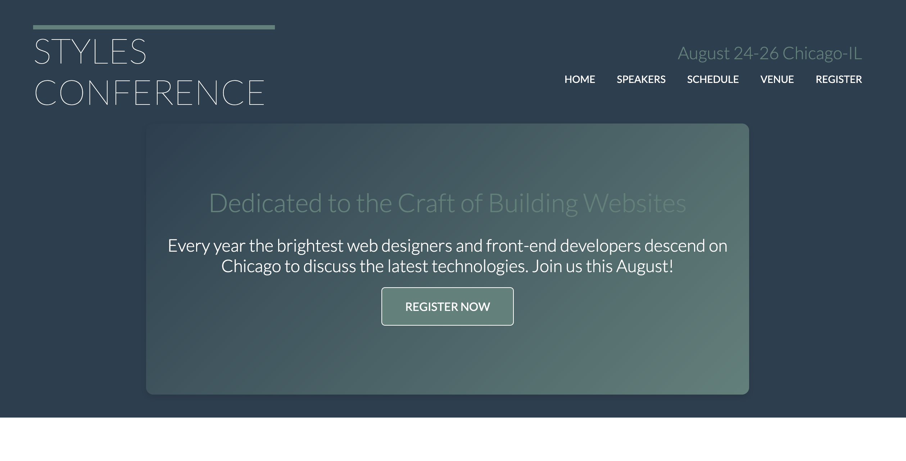
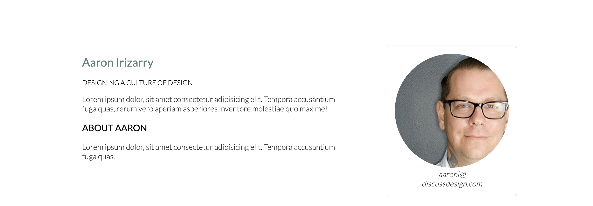
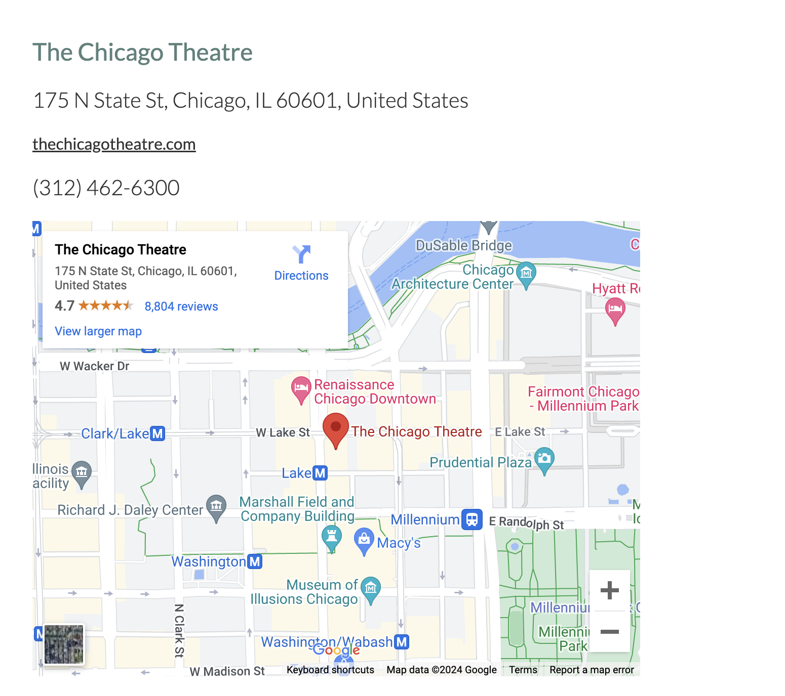
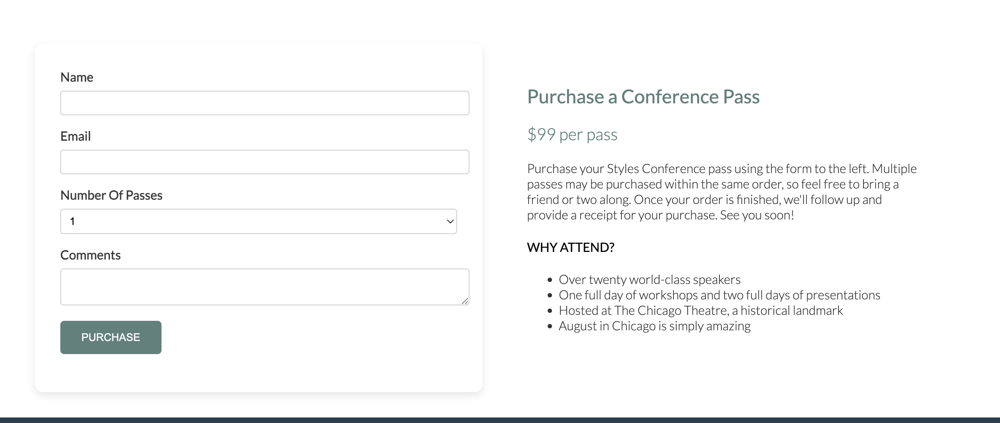

# Styles Conference

## Description
This project showcases a mock website for the "Styles Conference," an annual event for web designers and front-end developers. The website includes various sections such as Home, Speakers, Schedule, Venue, and Registration, each styled with a cohesive design using HTML, CSS, and JavaScript.

## Features
- **Home Page**: Overview of the conference with a call-to-action to register.
- **Speakers Page**: List of featured speakers with their bios and session topics.
- **Schedule Page**: Detailed conference schedule.
- **Venue Page**: Information about the venue and nearby accommodations.
- **Registration Page**: Form to register for the conference, including purchasing passes and leaving comments.
- **Responsive Design**: Ensures the site is accessible on various devices.

## Installation
Clone the repository and open `index.html` in your browser.

## Usage
Navigate through the different sections of the website to explore the conference details. Use the registration form to simulate signing up for the event.

## Screenshots## Screenshots






```bash
git clone https://github.com/leeluush/conferencehomepage.git
cd conferencehomepage
open index.html
